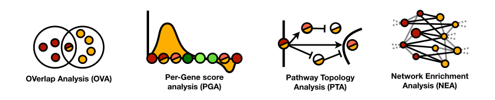

# EA benchmark

Introducing a comprehensive Enrichment Analysis (EA) benchmark for evaluating the performance of EA methods across diverse omics datasets. We address previous limitations, offering a curated selection of 82 gene expression datasets spanning 26 diseases. 

Our benchmark covers all four major categories of EA methods:
  
<p align="center">
  
</p>
  
To enhance sensitivity evaluation, we incorporate a Disease Pathway Network based on overlap and functional associations between KEGG pathways, mitigating the "single target pathway" shortcoming. We also assess method specificity independently, and analyzed biases towards pathways. 

Discover what method to use to get the most accurate functional characterization of your omics data. Alternatively, test your own EA method with our generalized benchmark.


## Getting Started

The EA benchmark is implemented in R (v4.1), and it was tested in a version-controlled conda environment. Before you can run this repository, make sure to set up:
  
  1. Miniconda environment with the required dependencies;
  2. GitHub Large File Storage (LFS) to download all the required data files. 

### Setting up miniconda

Install miniconda by following the instructions for your operating system: [Miniconda Installation](https://docs.conda.io/en/latest/miniconda.html). 

### Setting up GitHub LFS

Install Git LFS by following the installation instructions for your operating system: [Installing Git LFS](https://git-lfs.github.com/).


## Project setup

**Step 1: Installation**

Clone the EA benchmark repository and execute the following to generate a conda environment with all you need to run the EA benchmark:
```
cd eabenchmark
conda env create -f config/environment.yml
```

**Step 2: Activate environment**

Once you have created a new conda environment, make sure to activate it before running anything. 
```
conda activate eabenchmark
```

**NOTE**: All figures and tables are pre-generated and stored in dedicated folders under `notebooks/figures/` and `notebooks/tables/`, respectively. The notebook is also available as *html* file with the name `notebooks/BenchmarkFiguresAndTables.html`. However, you are welcome to reproduce the results executing the notebook from terminal. First, you need to edit the `root.dir` variable in the `setup` chunk with the full path to the eabenchmark repository like this `knitr::opts_knit$set(root.dir='/path/to/home/eabenchmark/')`. Second, you can run:

```
Rscript -e "rmarkdown::render('notebooks/BenchmarkFiguresAndTables.Rmd')"
```

**Step 3a: Install EA methods via Anaconda**

If you want to run the EA methods included in the benchmark, ensure to install them all first. You can do that by updating the conda environment with the following command:

```
conda env update -f config/environment+methods.yml --prune
```


**Step 3b: Install extra EA methods**

Some packages could not be installed via Anaconda, you can run the following:

  - To install `CePa`, `GSVA`, `NEAT` and `ANUBIX`, run `Rscript config/install_packages.R`

  - To install `BinoX` follow documentation [here](https://bitbucket.org/sonnhammergroup/binox/wiki/Installation), or run `git clone https://bitbucket.org/sonnhammergroup/binox.git`

## Project folder structure

The project is organized into the following main directories:

1. `data/`
   - This directory contains all the input data required for the benchmark. You can find the datasets and any necessary files needed for your analysis here.

2. `results/`
   - This directory stores the output and results generated by running the benchmark. It includes any tables, or other outcome files.

3. `notebooks/`
   - In this directory, you'll find R Markdown notebooks that provide an interactive and visual way to explore and visualize the benchmark data and results. Users can run these notebooks to gain insights and generate dynamic reports.

4. `src/`
   - The `src/` directory contains all the source code and scripts used to conduct the benchmark. This includes any custom functions, scripts for data preprocessing, and the main code for running the analysis.


## Test Your Own Method

Follow these steps to benchmark your own method within the Enrichment Analysis benchmark:

**Step 1: Add your own method**

1. Add your method's function to the `src/EAmethods` folder. The function should accept either a set of differentially expressed genes or gene expression data as a SummarizedExperiment R object.

For example, we added a random predictor in `src/EAmethods/random.R`. 
```
run_random = function(genes,gene_sets_list){                          
  
  ## Extract pathway ids, number of pahtways
  gs_names = names(gene_sets_list)
  gs_length = length(gene_sets_list)
  
  ## Sample pvalues from uniform distribution
  set.seed(length(genes))
  pval_uniform = runif(gs_length,min=0,max=1)
  
  ## Output a data frame with pathway_id,Pvalue as columns
  enrichment_df = data.frame(
    pathway_id = gs_names,
    Pvalue = pval_uniform
    )  
   
  return(enrichment_df)
}
```

2. Identify the category to which your method belongs: OVA, PGA, PTA, or NEA.

3. Include a call to your method's function within the dedicated EA category in `src/EAcategory`.

For example, we edited the *run_enrichment* function in `src/EAcategory/TPbenchmark/OVA.R` to include the random predictor defined in `src/EAmethods/random.R` like this: 
```
run_enrichment = function(d){
  library(tidyverse)
  
  x = dataset_df[dataset_df$GEO==d,]
  
  if (method_name == 'ease'){
    source('src/methods/ease.R')
    ptm = proc.time()
    tmp_enrichment_df = run_ease(as.character(unlist(stringr::str_split(x[['GeneID']],','))),
                                 PT=as.numeric(x[['GenomeCoverage']]),
                                 kegg_list)
    tmp_enrichment_df$GEO = x[['GEO']]
  } else if (method_name == 'fisher'){
    source('src/methods/fisher.R')
    ptm = proc.time()
    tmp_enrichment_df = run_fisher(as.character(unlist(stringr::str_split(x[['GeneID']],','))),
                                   PT=as.numeric(x[['GenomeCoverage']]),
                                   kegg_list)
    tmp_enrichment_df$GEO = x[['GEO']]
  } else if (method_name == 'random'){
    source('src/methods/random.R')
    ptm = proc.time()
    tmp_enrichment_df = run_random(as.character(unlist(stringr::str_split(x[['GeneID']],','))),
                                   kegg_list)
    tmp_enrichment_df$GEO = x[['GEO']]
  }
  
  runtime = proc.time() - ptm
  tmp_enrichment_df$user=round(runtime[[1]],2)
  tmp_enrichment_df$system=round(runtime[[2]],2)
  tmp_enrichment_df$elapsed=round(runtime[[3]],2)
  return(tmp_enrichment_df)
}
```


**Step 2: Run your own method**

Run both TPbenchmark and FPbenchmark from `src/EAcategory`. Ensure that your method produces output with at least the following three columns: GEO, pathway_id, Pvalue.

**Step 3: Evaluate your own method performance**

Add your method's name to the list of methods in the following scripts in `src/PerformanceEvaluation`:

   - Use `gather_results.R` to collect all your predictions into a single file. The outputs are stored as `results/stats/TPbenchmark.tsv.gz`, `results/stats/FPbenchmark_balanced.tsv.gz` and `results/stats/FPbenchmark.tsv.gz`. 

   - Run `extract_ranking.R` and `extract_tpr&fpr.R` to extract the performance metrics for all methods. The outputs are stored as `results/stats/Ranking(AVG).tsv.gz`, `results/stats/stats_balanced.tsv.gz`.
   
**Step 4: Visualize your method performance**

Visualize the benchmark results by utilizing the notebook `notebooks/BenchmarkFigures&Tables.Rmd`.

By following these steps, you can comprehensively evaluate the performance of your method within our Enrichment Analysis benchmark and assess its accuracy in functional characterization of omics data.


### Contacts ###

* Davide Buzzao (davide.buzzao@scilifelab.se)
* Erik L.L. Sonnhammer (erik.sonnhammer@scilifelab.se)
